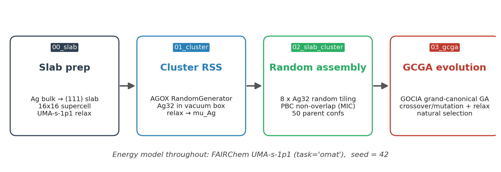
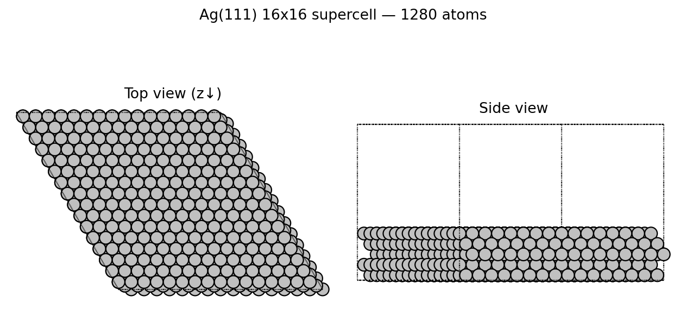
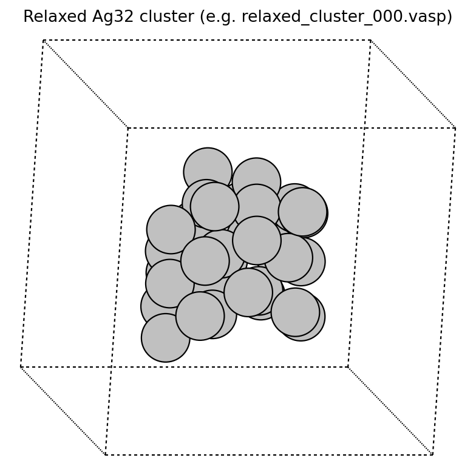
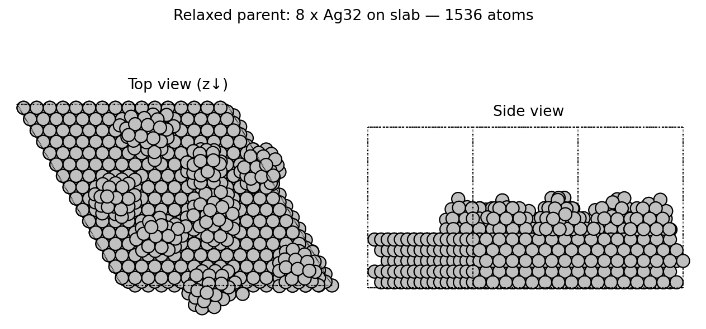
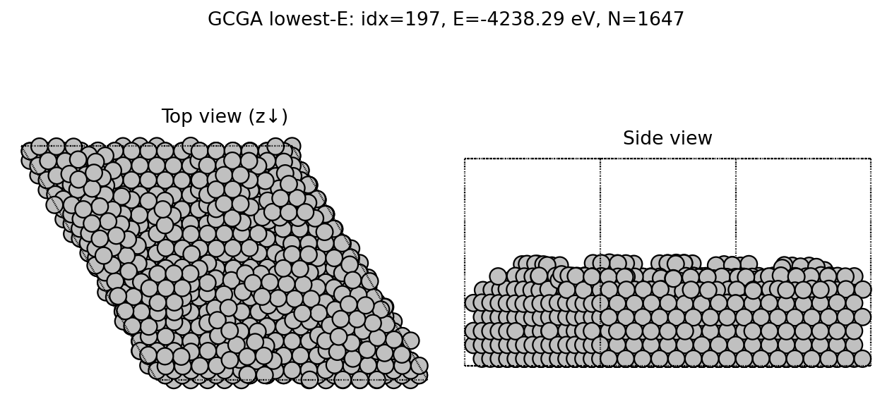
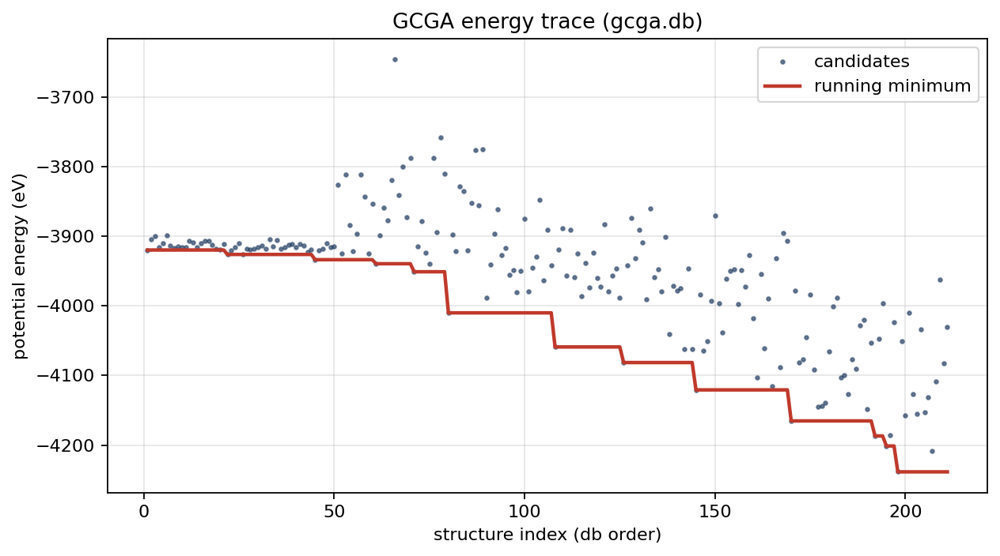

<!-- _paginate: false -->
<!-- _header: '' -->
<!-- _footer: '' -->

# Hierarchical Structure Search for Ag/Ag(111) Surfaces

### A Four-Stage Pipeline: RSS → Random Assembly → GCGA

<br>

**Atomistic stack:** ASE · pymatgen · spglib · AGOX · GOCIA
**Energy model:** FAIRChem **UMA-s-1p1** (`task_name="omat"`)
**Target system:** Ag<sub>32</sub> clusters on Ag(111) 16×16 supercell (≈1536 atoms)

<br>

<span class="small">Working directory: <code>~/05_AGOX/13</code></span>

---

## Motivation & Strategy

**Problem.** Direct global optimization on a multi-cluster Ag/Ag(111) surface (~1.5k atoms) is intractable: configuration space scales combinatorially with atom count, and full DFT is prohibitively expensive.

**Idea.** Decompose the search into **physically motivated sub-problems**, each solved with the cheapest method that still captures the relevant physics, then assemble the results.

<div class="cols">
<div>

### Decomposition

1. **Substrate** — fix the Ag(111) slab once
2. **Building blocks** — find low-energy Ag<sub>32</sub> motifs in vacuum
3. **Initial population** — randomly tile motifs onto the slab
4. **Global search** — evolve under a grand-canonical GA

</div>
<div>

### Why it works

- Substrate degrees of freedom decoupled from adsorbate
- Cluster RSS explores chemistry of building blocks
- Random tiling seeds GA with diverse, locally sensible parents
- MLIP gives DFT-quality forces at MD-like cost

</div>
</div>

---

## Pipeline Overview



<span class="tag">Single MLIP</span> Every relaxation uses **UMA-s-1p1 / OMat** for a consistent PES — no cross-method energy bias when seeding the GA.
<span class="tag">Seeded RNG</span> `seed = 42` across `random`, `numpy`, `torch` (CPU+CUDA) for reproducibility.
<span class="tag">Restart-safe</span> GA loop recovers `kidnum` by scanning `s000NNN/`; `STOP` sentinel halts cleanly.

---

## Stage 1 — Slab Preparation (`00_slab/slab.py`)

<div class="cols">
<div>

### Procedure

1. **Bulk vc-relax** of Ag (CIF) with `FrechetCellFilter` + `BFGSLineSearch`, `fmax = 1e-2`
2. **Symmetry-fixed**: `FixSymmetry(symprec=1e-5)` to preserve Fm-3m
3. **Slab cut** with `pymatgen.surface.SlabGenerator`
   - `miller_index = (1,1,1)`
   - `min_slab_size = 8 Å`, `min_vacuum_size = 20 Å`
   - `symmetrize=True`, `lll_reduce=True`
4. **Truncate** topmost atom; **fix bottom two layers** (`FixAtoms`)
5. **Supercell** `slab * (16, 16, 1)` → relax (`fmax = 1e-2`)

</div>
<div>



<span class="small">Output: `4_Ag_slab_supercell_opt.vasp` — 1280-atom substrate reused by every downstream stage. A single fully relaxed substrate avoids re-relaxing it during every GA step.</span>

</div>
</div>

---

## Stage 2 — Cluster RSS (`01_cluster/`)

<div class="cols">
<div>

### `rss_parallel.py` — AGOX random search

- `RandomGenerator` in a confined cubic box,
  side $L = (20 n_\text{Ag})^{1/3}$ (≈13.5 ų/atom)
- `LocalOptimizationEvaluator` + `BFGSLineSearch`,
  `fmax = 1e-2`, `steps = 500`
- **100 AGOX iterations** per stoichiometry; here `n_ag = 32`
- Database `db_Ag32.db` → `all_candidates_Ag32.traj`

### Chemical potential

$$
\mu_\text{Ag} \;=\; \frac{1}{N}\, E_\text{cluster},\quad N = 32
$$

The **min** $\mu_\text{Ag}$ (= **−2.084 eV**) seeds the GCGA chemical potential.

</div>
<div>



<span class="small">`cluster_relaxation.py` re-relaxes each AGOX candidate under UMA-s-1p1 and reports per-atom energy.</span>

</div>
</div>

---

## Stage 3 — Slab + Cluster Assembly (`02_slab_cluster/rss_surface.py`)

<div class="cols">
<div>

### Geometric placement algorithm

For each of `NUM_STRUCTURES = 50` parents:
1. Sample **8 distinct** relaxed Ag<sub>32</sub> clusters
2. For each cluster:
   - center XY at origin, set $z_{\mathrm{min}} = 0$
   - compute enclosing radius $r_i = \max_j \lVert \mathbf{p}_j^{xy}\rVert$
3. Draw fractional XY ∈ [0,1]² uniformly
4. **Non-overlap test** with PBC via `ase.geometry.find_mic`:
   $$
   d_{xy}^{\mathrm{MIC}} \;\ge\; r_i + r_j + \Delta,\quad \Delta = 3~\text{\AA}
   $$
5. Place at $z = z_{\text{slab}}^{\mathrm{max}} + 2.5$ Å; retry up to 5000 attempts per cluster, 10 seed-shifted retries per structure

</div>
<div>

### Output

- `generated_surfaces/surface_NN.vasp` — 50 unique configurations
- 1280 (slab) + 256 (8 × Ag<sub>32</sub>) atoms each



<span class="small">`slab_cluster_relaxation.py` fixes atoms with $z < 11$ Å and relaxes the top with UMA-s-1p1 (`fmax = 0.1`, 1000 steps) → `generated_surfaces_relaxed/`. These seed GCGA.</span>

</div>
</div>

---

## Stage 4 — Grand-Canonical GA (`03_gcga/`)

<div class="cols">
<div>

### Setup — `00_prep_test_trajectory.py`

- Copies `4_Ag_slab_supercell_opt.vasp` → `sub-POSCAR` (first **1280** atoms only)
- Single-point UMA-s-1p1 energy per relaxed `surface_NN.vasp`
- Writes each into `gcga.db` as `parent_*` with `alive=1, done=1`

### Evolution — `01_gcga_run.py`

- **GOCIA** `PopulationGrandCanonical`
- Search box: full XY of slab cell, $z \in [8, 25]$ Å
- $\mu_\text{Ag} = -2.084104$ eV (from Stage 2)
- `popSize = 50`, `totConf = 3000`, `minConf = 1000`

</div>
<div>

### Loop

```text
while not converged or kid < minConf:
  kid = pop.gen_offspring_box(
          mutRate=0.5, ...)
  kid.preopt_hooke(cutoff=1.2)
  kid_opt = geomopt_iterate(
      kid, UMA,
      optimizer='BFGSLineSearch',
      fmax=0.1, relax_steps=500,
      substrate='../sub-POSCAR')
  pop.add_aseResult(kid_opt,
                    workdir=kiddir)
  pop.natural_selection()
```

</div>
</div>

<span class="small">Restart-safe: `kidnum` recovered by scanning `s000NNN/` directories. `STOP` sentinel file halts cleanly.</span>

---

## Stage 4 — Current Results (`gcga.db`)

<div class="cols">
<div>

### Lowest-energy candidate so far



<span class="small">211 candidates evaluated · running minimum $E = -4238.3$ eV at index 197 · $N_\text{atoms}=1647$</span>

</div>
<div>

### Energy trace



<span class="small">Running-min drops in discrete steps as new low-E motifs survive selection. Scatter spread indicates exploration is still active — GA has not yet stagnated.</span>

</div>
</div>

---

## Computational Footprint & Hyperparameters

<div class="cols">
<div>

### Energy model

| Parameter | Value |
|---|---|
| MLIP | FAIRChem **UMA-s-1p1** |
| Task | `omat` |
| Device | CUDA (single GPU) |
| Bulk fmax | `1e-2` eV/Å |
| Cluster fmax | `1e-2` eV/Å |
| Slab+cluster fmax | `1e-1` eV/Å |
| GA child fmax | `1e-1` eV/Å (≤500 steps) |

</div>
<div>

### System sizes

| Stage | Atoms | # structures |
|---|---|---|
| Bulk | 4 | 1 |
| Cluster | 32 | 100 (RSS) |
| Slab+cluster | 1536 | 50 parents |
| GA children | 1536 ± Δ | 1000–3000 |

</div>
</div>

<span class="tag">Job scheduler</span> <span class="small">PBS scripts (`batch.sh`, `batch_parallel.sh`) request `select=1:ncpus=20:ngpus=1`. RSS uses a `MAX_JOBS`-throttled background loop; GCGA runs single-threaded over GPU.</span>

---

## Takeaways & Outlook

### What the pipeline delivers

- **Reproducible**, MLIP-only path from bulk Ag → globally optimized Ag<sub>x</sub>/Ag(111) reconstruction
- Decoupled stages allow swapping components (e.g., different cluster size, different facet)
- $\mu_\text{Ag}$ obtained *in situ* from Stage 2 → consistent grand-canonical reference

### Knobs worth exploring

- **Cluster stoichiometry** beyond Ag<sub>32</sub> (extend the `rss_parallel.py` loop over `n_ag`)
- **Placement density / spacing** $\Delta$ in Stage 3 — controls initial population diversity
- **Mutation rate / translation vectors** in `gen_offspring_box` — sets exploration vs. exploitation
- **MLIP refinement**: DFT single-points on GA finalists for publication-quality energies

### Validation TODO

- Compare GCGA minima against literature Ag(111) reconstructions
- Convergence diagnostics: $\langle E \rangle$ vs. `kidnum`, population diversity metric
